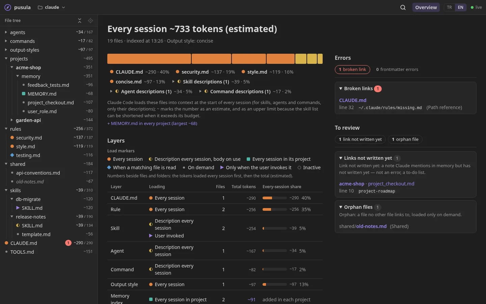
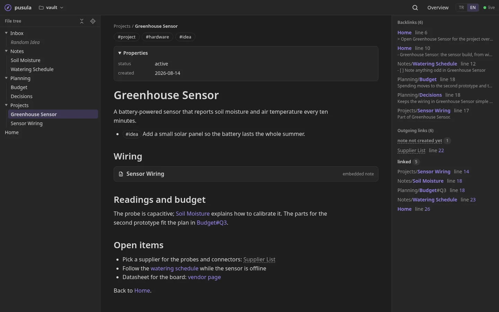

**English** · [Türkçe](README.tr.md)

# pusula

[](https://github.com/faraday208/pusula/actions/workflows/ci.yml)

**Read your AI agent configuration and your Markdown vaults in the browser.** pusula is a small local server that
shows a folder such as `~/.claude`, an Obsidian vault or any folder of Markdown files as a readable, linked site:
which file links to which, what is broken, and — for Claude Code — what every session loads and what it costs.

It runs on your own computer and only reads. Nothing leaves your machine.



## What you get

- **File tree and rendered Markdown** with wikilinks, callouts, task lists, tags and embedded notes.
- **Links and backlinks** for every file, with the line each link is on.
- **For `~/.claude`:** when each file is loaded (every session, when a matching file is read, on demand, only when
  you invoke it) and roughly how many tokens it adds — so you can see why every session starts heavy.
  Memory notes are linked by the `name` in their frontmatter.
- **Health checks:** broken links, orphan files, links to memories or notes that are not written yet, frontmatter
  errors with the line they are on.
- **For Obsidian vaults:** wikilinks resolved the way Obsidian does, tags, the entry note, recently changed and most
  linked notes.
- **Live:** pages update while Claude (or you) edit the files.
- **Several folders:** keep a list of sources and switch between them; add one from the browser with a folder picker.
- Two languages (English, Turkish), keyboard friendly, works on a tablet or phone.



## Quick start

You need the [.NET 10 SDK](https://dotnet.microsoft.com/download).

```bash
git clone https://github.com/faraday208/pusula.git
cd pusula
dotnet run --project src/Pusula -- "$PWD/samples/claude" "$PWD/samples/vault"   # try it on the synthetic demo
dotnet run --project src/Pusula -- ~/.claude                                     # your own configuration
```

Open <http://localhost:5190>. Give folders as absolute paths or starting with `~`: `dotnet run` starts the server in
`src/Pusula`, so a relative path would be looked up there. `"$PWD/…"` works in bash, zsh and PowerShell.

## Sources

With no folders on the command line, pusula reads its list of sources from `sources.json` in your user
configuration folder (`~/.config/pusula/` on Linux, `%APPDATA%\pusula\` on Windows; the **Sources** page shows the
exact path). Without that file it shows `~/.claude`.

```json
{
  "sources": [
    { "name": "~/.claude", "path": "~/.claude" },
    { "name": "Notes", "path": "~/Documents/notes" }
  ]
}
```

On Windows, write a path with forward slashes (`C:/Users/you/notes`) or doubled backslashes (`C:\\Users\\you\\notes`): the file is
JSON, where a single backslash starts an escape.

- **Add or remove** sources on the Sources page: **Choose folder…** lists the Obsidian vaults it finds on the disk and
  the folders of linked notes it recognizes by their content (an entry note such as `README.md` or `Home.md`, mostly
  Markdown files, wikilinks between the notes), and lets you browse folders. Changes are written to `sources.json`;
  editing the file by hand works too, without a restart.
- **Profiles** are detected automatically: a folder with `.obsidian/` is an Obsidian vault, a Claude Code
  configuration folder is shown with load layers and tokens, anything else as plain Markdown.
- **Folders on the command line** (`dotnet run --project src/Pusula -- <folder> [<folder>…]`, absolute paths, before any option such as `--urls`)
  replace the list.

## Remote access

pusula reads the folders of the computer it runs on; another device is just a screen. **pusula has no login**: anyone
who can reach its address can read the files it shows. By default it listens on `localhost` only.

| Way | How | |
|---|---|---|
| Private network ([Tailscale](https://tailscale.com) or similar) | `dotnet run --project src/Pusula -- --urls http://<tailscale-ip>:5190` | ✅ recommended: encrypted, only your devices |
| SSH tunnel | `ssh -L 5190:localhost:5190 <user>@<computer>`, then open <http://localhost:5190> | ✅ |
| Home network (LAN address) | `--urls http://<lan-ip>:5190` | ⚠️ only on a network you trust: plain HTTP |
| The internet (port forwarding, public tunnels) | | ❌ don't |

Adding or removing sources and browsing folders work only from the computer pusula runs on. To allow them from your
private network too, start it with `--Pusula:AllowRemoteEdit true`. Other websites can never change your sources or
browse your folders, whatever the setting, and the server answers only to IP addresses, `localhost`, its own machine name and `*.ts.net`; add other names with
`--Pusula:AllowedHosts "name1;name2"`.

## Privacy and safety

- **Read-only.** pusula never writes to the folders it shows. The only file it writes is its own `sources.json`.
- **Only `.md` files are indexed and served**; `settings.json`, credentials and other files never leave the server.
- **Recognizing note folders reads a little of your notes.** To tell a folder of notes that has no `.obsidian/` folder,
  **Choose folder…** reads the first few kilobytes of some of its notes (at most 20 per folder) and only looks for a
  wikilink. This happens on this computer only; nothing of what it reads is kept or sent anywhere.
- **Links to network locations are never followed.** A symbolic link that leads to a network path (a `\\server\share`
  path on Windows) is skipped and never opened, so a folder that someone else made cannot make pusula contact a server.
- **Local-first.** No accounts, no telemetry, no network access needed; the JavaScript libraries are in the repository.

## Limits

- Token counts are a rough estimate (characters ÷ 4).
- Images, Mermaid diagrams, Obsidian Bases, canvases and footnotes are not drawn yet; raw HTML is shown as text.
- Run it with `dotnet run`; a published binary started from another folder does not find its web files yet.

## Updating

pusula uses [semantic versioning](https://semver.org). Every release gets a tag (`v0.1.0`), an entry in
[CHANGELOG.md](CHANGELOG.md) and a page under [Releases](https://github.com/faraday208/pusula/releases).

- **To hear about new releases:** on GitHub choose **Watch → Custom → Releases**.
- **To update:** `git pull`, then start pusula again.
- **Which version am I running?** It is shown at the bottom of the Sources page, and
  `dotnet run --project src/Pusula -- --version` prints it.

pusula never checks for updates by itself: it makes no network requests.

## Development

```bash
dotnet build pusula.slnx
dotnet test --solution pusula.slnx                                                  # .NET tests
node --disable-warning=MODULE_TYPELESS_PACKAGE_JSON --test "tests/web/*.test.mjs"   # UI tests
```

- `src/Pusula`: one ASP.NET Core project (minimal APIs) — the server indexes the folders and answers JSON; the UI in
  `src/Pusula/wwwroot` is plain HTML, CSS and JavaScript with no build step. API description: `/openapi/v1.json`.
- Tests use synthetic data only. `CLAUDE.md` holds the rules for contributors and their AI agents.

## Contributing

pusula is a small, selective project: every feature rests on a real use. Bug reports, fixes and ideas are welcome.
Send a small fix straight away; for anything bigger, please open an issue first, so we can agree on it before you
spend time on it.

- [CONTRIBUTING.md](CONTRIBUTING.md): how to build, test and send a change
- [CODE_OF_CONDUCT.md](CODE_OF_CONDUCT.md): how we treat each other
- [SECURITY.md](SECURITY.md): how to report a vulnerability privately, not in an issue

## License

[Apache-2.0](LICENSE)
