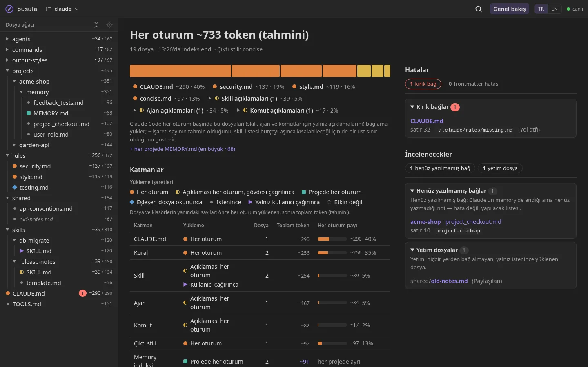
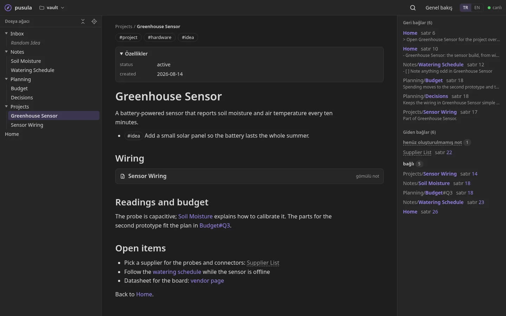

[English](README.md) · **Türkçe**

# pusula

**AI ajan yapılandırmanı ve Markdown kasalarını tarayıcıda oku.** pusula küçük, yerel bir sunucu: `~/.claude` gibi
bir klasörü, bir Obsidian kasasını ya da herhangi bir Markdown klasörünü okunur, bağlantılı bir site olarak gösterir.
Hangi dosya hangisine bağlanıyor, ne kırık, ve Claude Code için her oturum ne yüklüyor, kaç token tutuyor.

Senin bilgisayarında çalışır ve yalnız okur. Hiçbir veri bilgisayarından çıkmaz.



## Neler var

- **Dosya ağacı ve Markdown görünümü:** wikilink, callout, görev listesi, etiket ve gömülü notlarla.
- **Bağlar ve geri bağlar:** her dosya için, her bağın satırıyla.
- **`~/.claude` için:** her dosyanın ne zaman yüklendiği (her oturum, eşleşen dosya okununca, istenince, yalnız sen
  çağırınca) ve aşağı yukarı kaç token eklediği; her oturumun neden ağır başladığını görürsün. Memory notları
  frontmatter'daki `name` ile bağlanır.
- **Sağlık denetimi:** kırık bağlar, yetim dosyalar, henüz yazılmamış memory ya da not bağları, satırıyla
  frontmatter hataları.
- **Obsidian kasaları için:** Obsidian'ın yaptığı gibi çözülen wikilink'ler, etiketler, giriş notu, son değişen ve
  en çok bağ alan notlar.
- **Canlı:** Claude (ya da sen) dosyaları düzenlerken sayfa kendiliğinden güncellenir.
- **Birden çok klasör:** kaynak listesi tut, aralarında geç; tarayıcıdan klasör seçiciyle ekle.
- İki dil (Türkçe, İngilizce), klavyeyle kullanılır, tablette ve telefonda çalışır.



## Hızlı başlangıç

[.NET 10 SDK](https://dotnet.microsoft.com/download) gerekir.

```bash
git clone https://github.com/faraday208/pusula.git
cd pusula
dotnet run --project src/Pusula -- "$PWD/samples/claude" "$PWD/samples/vault"   # sentetik demoyla dene
dotnet run --project src/Pusula -- ~/.claude                                     # kendi yapılandırman
```

<http://localhost:5190> adresini aç. Klasörleri tam yolla ya da `~` ile ver: `dotnet run` sunucuyu `src/Pusula` içinde
başlatır, göreli yol orada aranır. `"$PWD/…"` bash, zsh ve PowerShell'de çalışır.

## Kaynaklar

Komut satırında klasör verilmezse pusula kaynak listesini kullanıcı ayar klasöründeki `sources.json`'dan okur
(Linux'ta `~/.config/pusula/`, Windows'ta `%APPDATA%\pusula\`; tam yolu **Kaynaklar** sayfası gösterir). Dosya
yoksa `~/.claude`'u gösterir.

```json
{
  "sources": [
    { "name": "~/.claude", "path": "~/.claude" },
    { "name": "Notlar", "path": "~/Documents/notlar" }
  ]
}
```

- **Ekle ya da kaldır:** Kaynaklar sayfasında **Klasör seç…** diskte bulduğu kasaları listeler ve klasörlerde
  gezinmeni sağlar. Değişiklik `sources.json`'a yazılır; dosyayı elle düzenlemek de olur, yeniden başlatmak gerekmez.
- **Profil** kendiliğinden anlaşılır: `.obsidian/` içeren klasör Obsidian kasasıdır, Claude Code yapılandırma
  klasörü katmanları ve token'larıyla gösterilir, gerisi düz Markdown olarak.
- **Komut satırındaki klasörler** (`dotnet run --project src/Pusula -- <klasör> [<klasör>…]`, tam yolla) listenin yerine geçer.

## Uzaktan erişim

pusula çalıştığı bilgisayarın klasörlerini okur; başka bir cihaz yalnız ekrandır. **pusula'nın girişi (parolası)
yok:** adresine ulaşabilen herkes gösterdiği dosyaları okuyabilir. Varsayılanda yalnız `localhost`'u dinler.

| Yol | Nasıl | |
|---|---|---|
| Özel ağ ([Tailscale](https://tailscale.com) ya da benzeri) | `dotnet run --project src/Pusula -- --urls http://<tailscale-ip>:5190` | ✅ önerilen: şifreli, yalnız senin cihazların |
| SSH tüneli | `ssh -L 5190:localhost:5190 <kullanıcı>@<bilgisayar>`, sonra <http://localhost:5190> | ✅ |
| Ev ağı (LAN adresi) | `--urls http://<lan-ip>:5190` | ⚠️ yalnız güvendiğin ağda: şifresiz HTTP |
| İnternet (port yönlendirme, açık tüneller) | | ❌ yapma |

Kaynak eklemek, kaldırmak ve klasörlerde gezinmek yalnız pusula'nın çalıştığı bilgisayardan olur. Özel ağından da
açmak için `--Pusula:AllowRemoteEdit true` ile başlat. Başka siteler, ayar ne olursa olsun, kaynaklarını
değiştiremez ve klasörlerinde gezinemez; sunucu yalnız IP adreslerine, `localhost`'a, kendi makine adına ve `*.ts.net`'e cevap verir, başka adlar için
`--Pusula:AllowedHosts "ad1;ad2"`.

## Gizlilik ve güvenlik

- **Salt-okunur.** pusula gösterdiği klasörlere asla yazmaz. Yazdığı tek dosya kendi `sources.json`'u.
- **Yalnız `.md` dosyaları indekslenir ve sunulur**; `settings.json`, kimlik bilgileri ve öteki dosyalar sunucudan çıkmaz.
- **Yerel öncelikli.** Hesap yok, telemetri yok, ağ gerekmez; JavaScript kütüphaneleri repoda.

## Sınırlar

- Token sayısı kaba bir tahmindir (karakter ÷ 4).
- Görseller, Mermaid diyagramları, Obsidian Bases, canvas ve dipnotlar henüz çizilmiyor; ham HTML metin olarak görünür.
- `dotnet run` ile çalıştır; başka klasörden başlatılan yayınlanmış ikili şimdilik web dosyalarını bulamıyor.

## Geliştirme

```bash
dotnet build pusula.slnx
dotnet test --solution pusula.slnx                                                  # .NET testleri
node --disable-warning=MODULE_TYPELESS_PACKAGE_JSON --test "tests/web/*.test.mjs"   # arayüz testleri
```

- `src/Pusula`: tek ASP.NET Core projesi (minimal API): sunucu klasörleri indeksler ve JSON döner; `src/Pusula/wwwroot`
  altındaki arayüz düz HTML, CSS ve JavaScript, derleme adımı yok. API tanımı: `/openapi/v1.json`.
- Testler yalnız sentetik veri kullanır. Katkıcılar ve onların yapay zekâ ajanları için kurallar `CLAUDE.md`'de.

## Lisans

[Apache-2.0](LICENSE)
